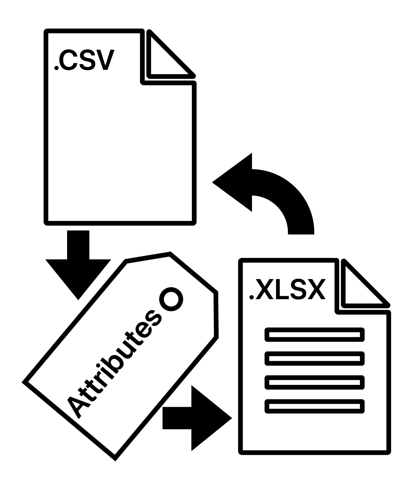

Efficiently generating product descriptions for a large number of items with commonalities and varying attributes is a complex task. During my internship, I discovered TagPop, a powerful Python script that significantly accelerates this process. In this post, I'll introduce TagPop and explain how it can enhance your workflow when dealing with similar products with attribute variations.

## TagPop Overview:
TagPop is a Python script that automates the insertion of attribute information into product descriptions, eliminating the need for manual content creation. It leverages Python libraries like Pandas and regular expressions to achieve this. The configuration file, 'config.ini,' specifies input and output files, attribute data sources, and tag patterns for attribute identification.

## How TagPop Works
1. **Data Preparation:** TagPop requires three essential components: an input Excel file containing product data, an output Excel file for storing modified data, and a CSV file with attribute information. Configuration settings in 'config.ini' guide TagPop in handling these files.

2. **Attribute Identification:** TagPop uses regular expressions to identify attributes within product descriptions. These attributes are enclosed in square brackets, e.g., `[color]` or `[size]`.

3. **Attribute Replacement:** For each product, TagPop matches identified tags with attributes from the CSV file. If a match is found, it replaces the tags in the product description with the corresponding attribute value, ensuring detailed and accurate descriptions.

4. **Logging:** TagPop includes a logging feature to record tag-to-attribute replacements, offering transparency and accountability in the content generation process.

5. **Master Model Extraction:** TagPop also extracts the master model number from each product, providing additional data for analysis or categorization.

6. **Excel Processing:** After processing all products, TagPop saves the modified data as a new Excel file, following the configuration's specified output path. This file contains updated product descriptions and master model numbers.

## Key Benefits
1. **Time Efficiency:** TagPop drastically reduces the time required for manual description writing, enabling you to focus on strategic tasks.

2. **Accuracy:** By sourcing attributes from a CSV file, TagPop ensures consistent and accurate descriptions, particularly beneficial for large inventories.

3. **Transparency:** The logging feature allows you to monitor changes, facilitating quality control and auditing.

4. **Scalability:** TagPop efficiently handles tasks of any scale, making it suitable for businesses of all sizes.

In e-commerce and product management, streamlining product description generation is another tool in perfecting your product. TagPop's automation of attribute insertion improves productivity and content quality.

Give TagPop a try and witness how it can boost your productivity and the quality of your product listings.

[GitHub Repository - TagPop](https://github.com/psibir/tagpop)
